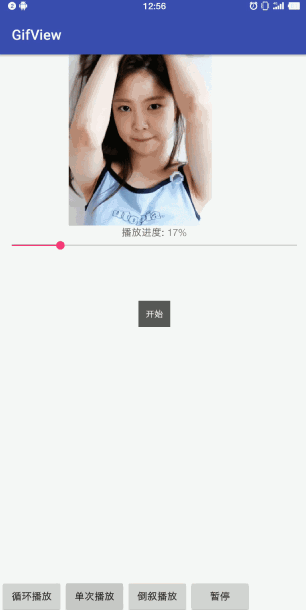

# GifView
Gif图片自定义显示


博客地址：
[Gif图片自定义显示](https://juejin.im/post/59e95e09f265da430405bf33)
```html
<com.renny.gifview.GifImageView
        android:id="@+id/gif"
        android:layout_width="240dp"
        android:layout_height="240dp"
        android:layout_centerHorizontal="true"
        app:end_last_frame="true"
        app:play_count="1"
        />
```

```html
<declare-styleable name="GifImageView">
        <!--gif文件引用-->
        <attr name="gif_src" format="reference"  />
        <!--是否加载完自动播放-->
        <attr name="auth_play" format="boolean"  />
        <!--播放次放，默认永远播放-->
        <attr name="play_count" format="integer"  />
        <!--播放完成后是否停留在最后一帧，默认false-->
        <attr name="end_last_frame" format="boolean"  />
    </declare-styleable>
```

